<h1 align="center">Visit Madeira</h1>

[View the live project here.](https://dannybc98.github.io/1st-milestone-project-Danny/)

This website is designed as a guide for anyone who is planning to visit Madeira Island and have a unique experience.Whether you're a first-time or a returning traveler, this website provides you with valuable information about the main attractions and activities that Madeira has to offer.

## Table of Contents

- [User Experience](#user-experience "User Experience")
  - [Site Purpose](#site-purpose "Site Purpose")
  - [Site Goal](#site-goal "Site Goal")
  - [Audience](#audience "Audience")
  - [Communication](#communication "Communication")
  - [User Goals](#user-goals "User Goals")
- [Design](#design "Design")
  - [Colour Scheme](#colour-scheme "Colour Scheme")
  - [Typography](#typography "Typography")
  - [Imagery](#imagery "Imagery")
- [Wireframes](#wireframes "Wireframes")
- [Features](#features "Features")
  - [Existing Features](#existing-features "Existing Features")
  - [Future Features](#future-features "Future Features")
- [Testing](#testing "Testing")
  - [Validator Testing](#validator-testing "Validator Testing")
  - [Elements Testing](#elements-testing "Elements Testing")
  - [Unfixed Bugs](#unfixed-bugs "Unfixed Bugs")
- [Technologies Used](#technologies-used "Technologies Used")
  - [Main Languages Used](#main-languages-used "Main Languages Used")
- [Deployment](#deployment "Deployment")
- [Credit](#credit "Credit")
  - [Content](#content "Content")
  - [Media](#media "Media")
  - [Acknowledgments](#acknowledgements "Acknowledgements")

## User Experience

### User Stories

- As a traveler, I want the "Travelling to Madeira" website to be easy to navigate, allowing me to find information about various destinations and activities effortlessly.

- As a traveler, I want the website to provide engaging and visually appealing content, showcasing the beauty of Madeira and enticing me to explore the island.

- As a traveler, I want easy access to the essential travel information, such as visa requirements, local transportation options, and safety tips, to plan my trip effectively.

- As a traveler, I want the website to have clear and user-friendly controls for interactive elements, such as maps, and images to enhance my browsing experience.

- As a traveler, I want the website to be responsive and mobile-friendly, enabling me to access it conveniently on various devices, such as smartphones and tablets, while I explore Madeira.

### Site Purpose:

To provide essential information, inspire interest, and guide travelers in planning their trip to Madeira Island effectively.

### Site Goal:

To become a comprehensive and reliable resource for travelers seeking information, inspiration, and assistance in planning their trips to Madeira Island. The site aims to offer valuable content, attract a targeted audience interested in visiting Madeira, and ultimately drive engagement and conversions, such as booking accommodations, tours, or other travel-related services

### Audience:

The audience of the website is travelers of various ages, from young adults to seniors, interested in exploring Madeira's attractions, outdoor activities, natural beauty, and cultural experiences.

### Communication:

The website about traveling to Madeira has three pages with distinct goals: the homepage entices visitors, the "Things To do" page inspires with activities, and the "Travel Info" page provides practical guidance for trip planning.

### User Goals:

-Discover attractions, plan itineraries, and experience adventures and cultural immersion in Madeira.

-Find accommodations, check travel information, explore local cuisine, capture memorable moments and ensure safety.

- ### Design
  - #### Colour Scheme
    - The color scheme used features refreshing shades of green, creating a nature-inspired and visually appealing design, with white text ensuring readability and clarity throughout the content.
  - #### Typography
    - The website employs a combination of elegant and easy-to-read typography, featuring the "lugrasimo" font for section headers and important elements, while using the cursive "Edu SA Beginner" font for descriptive text.
  - #### Imagery
    - The imagery used in this website was sourced from "https://pixabay.com/". Includes hero images showcasing scenic views of Madeira's landscapes, enticing users to explore the island's attractions and activities.

* ### Wireframes

  - Home Page Wireframe - [View](assets/images/wireframe1.png)

  - Things-to-do Page Wireframe - [View](assets/images/wireframe2.png)

  - Travel-info Page Wireframe - [View](assets/images/wireframe3.png)

## Features

### Existing Features

#### Navigation links:

The website features navigation buttons on each page, allowing easy access to the Home, Things To Do, and Travel Info sections. The buttons have the hover effect, providing users with clear navigation feedback.

#### Home Page:

The Home page sets the tone for the website, featuring captivating a hero image showcasing Madeira's picturesque landscapes, inviting users to explore the island's beauty.

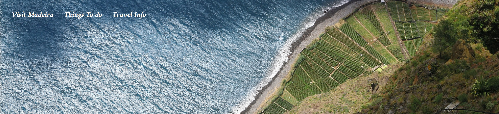

The content of the home page answers the user's most important question which is why they should visit this place, by showcasing some pictures of Madeira's nature, aitivities and culinary delights.

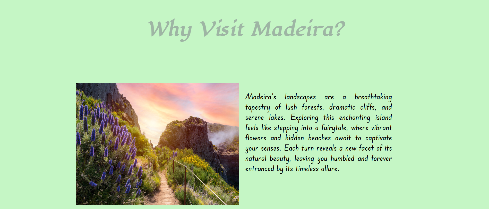

#### Things to do Page:

The striking hero image and comprehensive list of activities on the Things To Do page captivate users and inspire them to explore the various experiences Madeira has to offer. The well-organized layout and informative descriptions empower users to make informed decisions about their travel itinerary, elevating their overall travel planning experience.

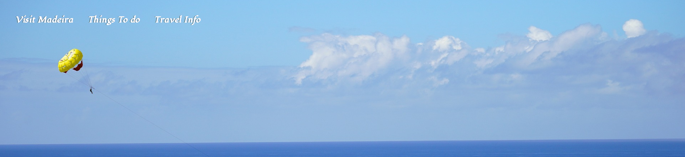

Below the hero image, a comprehensive list of activities is presented, each accompanied by captivating images, informative descriptions and google maps links to the locations, helping travelers plan their itineraries.

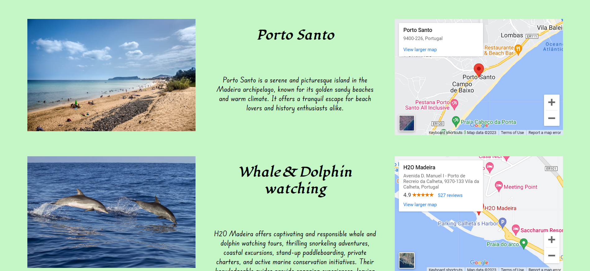

#### Travel Info Page:

The visually appealing hero image and essential travel information on the Travel Info page instill confidence in users, knowing they have access to valuable resources and tips for their upcoming trip to Madeira.

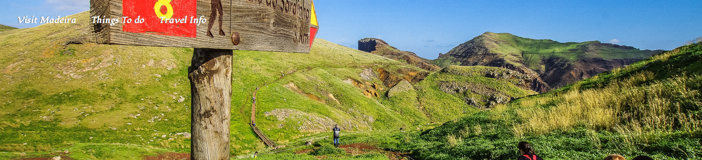

Below the hero image, users can find essential travel information, including visa requirements, transportation options, safety tips and accommodation advice, providing a seamless travel planning experience.

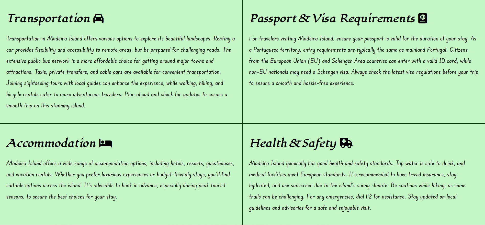

The inclusion of the subscription form establishes a personal connection with users, allowing them to receive relevant updates and promotions, enhancing engagement and fostering a sense of loyalty.

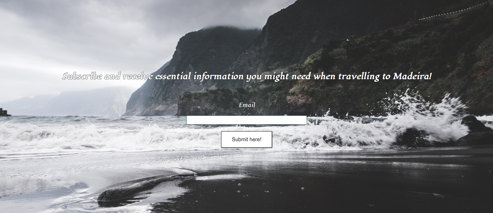

#### Footer:

The consistent footer with social links enables users to easily connect with the website through popular social media platforms, promoting user engagement and brand visibility. Improving overall user convenience and satisfaction.

### Future Features

- Reviews and Ratings system where users can share their experiences and feedback about specific places, activities, and accommodations, helping others make informed decisions.

- Weather and Seasonal Information: Include a weather widget or section that provides real-time weather updates and information about the best times to visit Madeira based on different seasons and activities.

## Testing

### Validator Testing

- HTML files passed the [W3C Validator](https://validator.w3.org/#validate_by_input) with no errors found.

  Home page html validation
  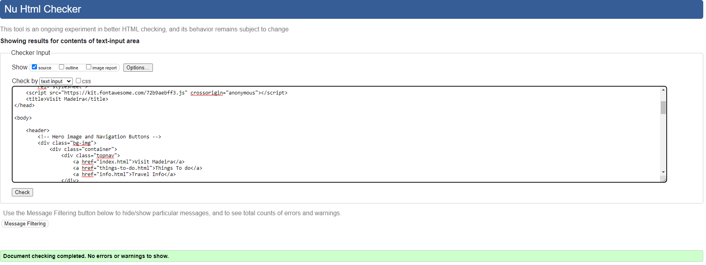
  Things to do page html validation
  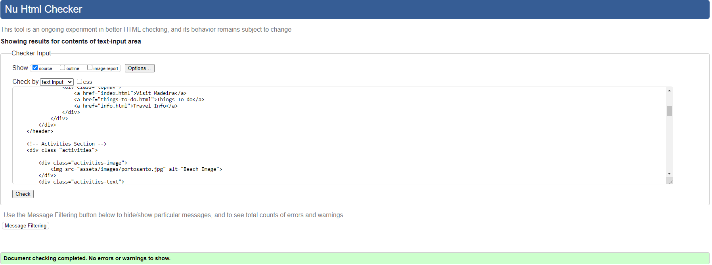
  Info page html validation
  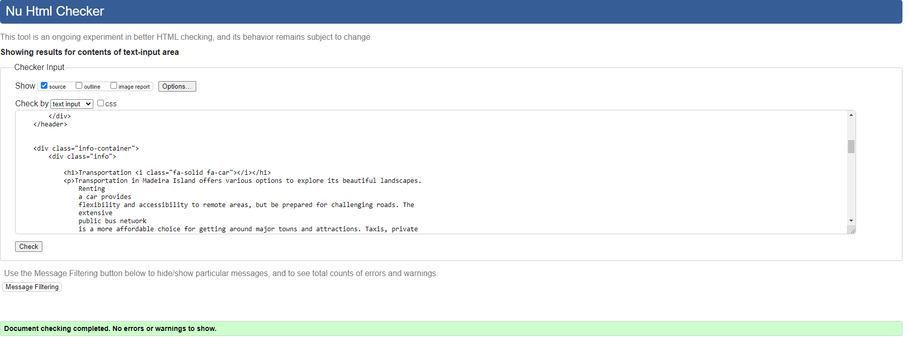

- CSS file passed the [Jigsaw Validator](https://jigsaw.w3.org/css-validator/#validate_by_input) with no errors found.
  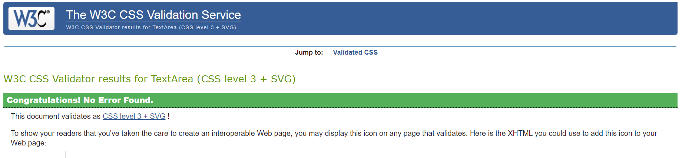

- The Website was tested on Google Chrome, Internet Explorer, Microsoft Edge and Safari browsers.

### Elements Testing

- General

| Feature           | Outcome                                                                                                                              | Pass/Fail |
| ----------------- | ------------------------------------------------------------------------------------------------------------------------------------ | --------- |
| Navigation links  | Hover effect and links are working as expected, providing easy navigation across the website.                                        | Pass      |
| Social Links      | Open the specific website on a new tab.                                                                                              | Pass      |
| Responsive Design | Ensure the website layout and elements adjust appropriately to different screen sizes, allowing seamless viewing on various devices. | Pass      |
| Google Maps       | Display interactive maps for each activity's location, assisting users in understanding its geographical context.                    | Pass      |
| Email Input       | Include an input field for users to enter their email address for subscription.                                                      | Pass      |
| Email Validation  | Ensure that the email input requires a valid email format before submission.                                                         | Pass      |
| Subscribe Button  | Hover effect works, and the form submits when clicked, allowing users to submit the email                                            | Pass      |
| Success Message   | Display a success message after clicking on submit button to confirm the user's                                                      |
| action.           | Pass                                                                                                                                 |

## Finished Product

| Page         | Desktop version                                                    |
| ------------ | ------------------------------------------------------------------ |
| Home         | 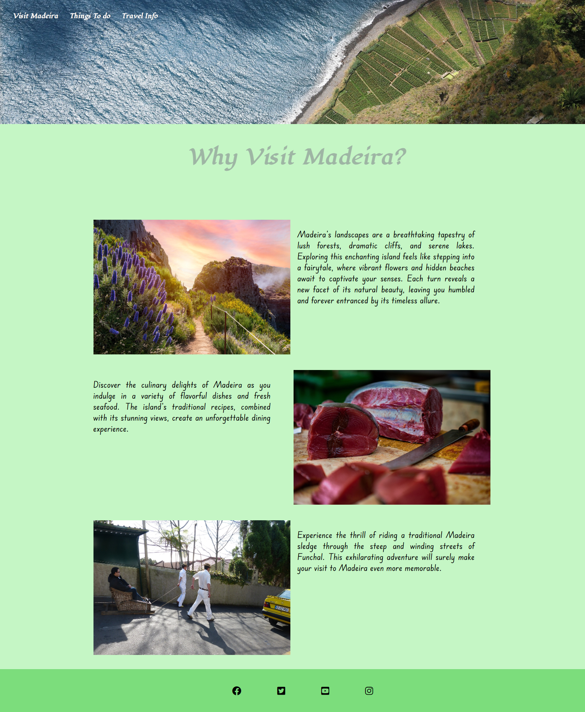            |
| Things to do | 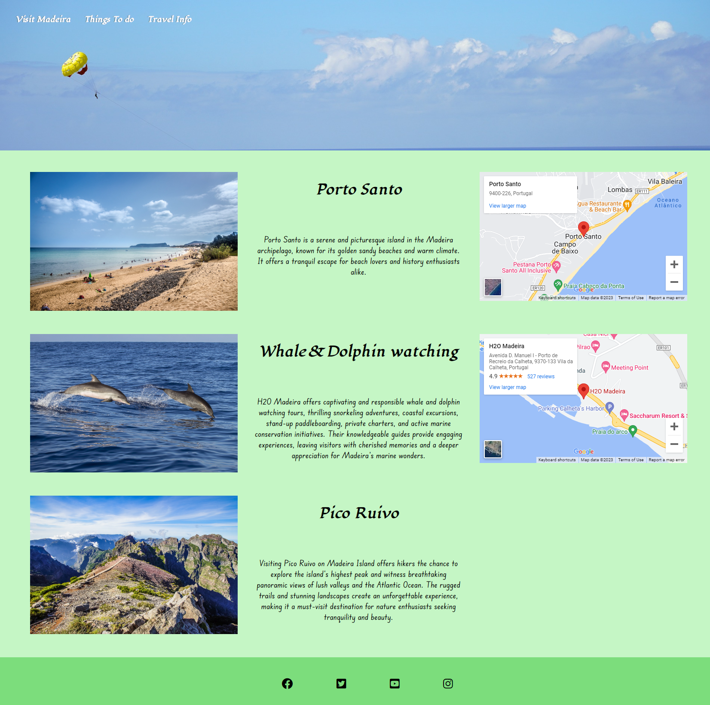 |
| Travel Info  | 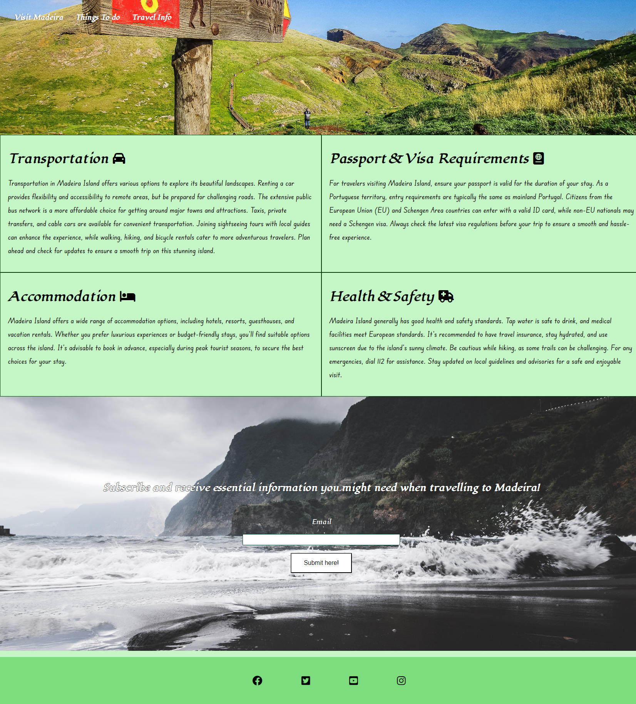   |

### Unfixed Bugs

None found.

## Technologies Used

### Main Languages Used

- HTML
- CSS

### Frameworks, Libraries & Programs Used

1. [Google Fonts:](https://fonts.google.com/)
   - Google fonts were used to import the "lugrasimo" and "Edu SA Beginner" fonts into the style.css file which is used on all pages throughout the project.
1. [Font Awesome:](https://fontawesome.com/)
   - Font Awesome was used on the travel info page to add icons for aesthetic and UX purposes.
1. [Codeanywhere](https://codeanywhere.com/)
   - Codeanywhere was used to write and push the code to the Github repository.
1. [GitHub:](https://github.com/)
   - GitHub is used to store the projects code after being pushed from codeanywhere.
1. [Balsamiq:](https://balsamiq.com/)
   - Balsamiq was used to create the wireframes.
1. [W3Schools:](https://www.w3schools.com/)
   - W3Schools was used as a tutorial to help with positioning mainly.

## Deployment

The project was deployed to GitHub Pages using the following steps...

1. Log in to GitHub and locate the [GitHub Repository](https://github.com/)
2. At the top of the Repository (not top of page), locate the "Settings" Button on the menu.
3. Scroll down the Settings page until you locate the "GitHub Pages" Section.
4. Under "Source", click the dropdown called "None" and select "main".
5. After "main" has been selected and saved, the page will automatically refresh.
6. A live link to the website will then appear at the top of the page.

## Credit

### Code

- Some CSS styles for the website layout and design were adapted from [https://www.w3schools.com/].

### Content

- All content was written by the developer

### Media

All the images were obtained from [here](https://pixabay.com/)

### Acknowledgements

- My mentor for the useful feedback throughout the duration of the project.

- Slack community for helping fix minor issues.

- Tutor support from Code Institute.
